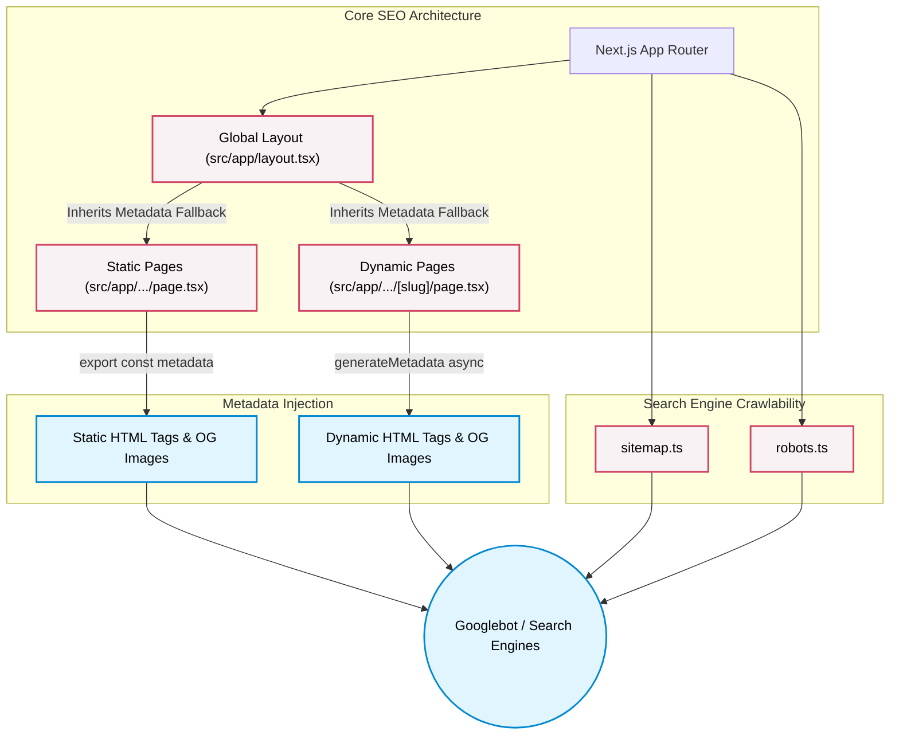

# 🚀 Mera Digital - Comprehensive SEO Management Guide

> [!IMPORTANT]
> **Welcome to the Mera Digital SEO Guide!**  
> This guide is tailored specifically for our **Next.js (App Router)** tech stack. Because we are using a modern React framework, our SEO is managed differently than traditional WordPress or HTML sites.

---

## 🏗️ 1. Understanding Our SEO Architecture

The Mera Digital website is built using **Next.js 13+ with the App Router**. This means we do not manually edit `<head>` tags in HTML files. Instead, Next.js provides a built-in Metadata API that automatically generates the correct HTML tags for Search Engines and Social Media platforms.

### 🧠 SEO Architecture Visualization



### 📁 Core Files for SEO Management

Here are the specific files you will need to modify for ongoing SEO support:

#### A. Global SEO Settings
- **File:** `src/app/layout.tsx`
- **Purpose:** This is the master file. It contains the default metadata (Title, Description, OpenGraph, Twitter Cards, and Favicons) that applies to *all* pages unless specifically overridden.
- **When to edit:** If you need to change the global default fallback title or update the main social sharing image (`/MER_DIGITALS_LOGO.png`).

#### B. Page-Specific SEO Settings
- **Files:** `src/app/[page-name]/page.tsx` (e.g., `src/app/about-us/page.tsx`, `src/app/services/page.tsx`)
- **Purpose:** Each individual page should export its own `metadata` object to override the global settings.
- **When to edit:** Every time you optimize a specific page (e.g., rewriting the meta description for the "About Us" page).

#### C. Dynamic Pages (Blogs, Case Studies)
- **Files:** `src/app/blogs/[slug]/page.tsx` or `src/app/case-studies/[slug]/page.tsx`
- **Purpose:** For content that comes from a database or CMS, we use the `generateMetadata` function to dynamically inject titles based on the article's actual title.
- **When to edit:** When setting up new dynamic templates to ensure variables map correctly to SEO fields.

#### D. Crawlability Files (Crucial for Future Support)
- **Files to Add/Maintain:** `src/app/sitemap.ts` and `src/app/robots.ts`
- **Purpose:** These files instruct Google on how to crawl the site. Next.js can generate these dynamically.
- **When to edit:** Whenever a new major section is added to the website, ensure it's reflected in the sitemap.

---

## 🛠️ 2. How to Update On-Page SEO (Step-by-Step)

If you need to update the Title or Meta Description of a static page, follow this exact workflow:

### Example: Updating the "About Us" Page

1. Open `src/app/about-us/page.tsx`.
2. Locate the `export const metadata` block at the top of the file:
```typescript
export const metadata = {
  title: 'About Mera Digital | Our Story & Vision',
  description: 'Learn about our journey, our values, and the team driving digital innovation for brands worldwide.',
};
```
3. Update the text strings with your new keyword-optimized content.
4. Save the file and commit the changes. Next.js will automatically inject the updated `<title>` and `<meta name="description">` tags.

---

## 🗺️ 3. Complete Page-by-Page SEO Directory

To ensure you can provide exceptional support for any section of the website, here is a detailed breakdown of every single page on the Mera Digital site. Use this as your master directory when a specific page needs an SEO refresh. This granular approach will show the client exactly how much control they have.

### 🏠 Home Page (The Front Door)
- **What it is:** The main landing page (`meradigital.com`). It serves as the primary gateway for all organic traffic.
- **Where to change SEO:** `src/app/page.tsx`
- **What to optimize:** Ensure the `<title>` clearly states the core value proposition (e.g., "Mera Digital | Premier Marketing & Web Agency"). The description should be highly converting and summarize the brand.

### 🏢 About Us
- **What it is:** The page detailing the agency's story, vision, and mission (`/about-us`).
- **Where to change SEO:** `src/app/about-us/page.tsx`
- **What to optimize:** Use keywords related to company trustworthiness, location (if applicable), and industry authority.

### 🛠️ Services
- **What it is:** The hub for all offerings like Web Development, SEO, PPC, etc. (`/services`).
- **Where to change SEO:** `src/app/services/page.tsx`
- **What to optimize:** Broad keywords encompassing the range of services provided. *(Note: Any sub-service pages inside this folder would also need their own `metadata` objects).*

### 📝 Blogs (Content Hub)
- **What it is:** The main blog feed and individual articles (`/blogs`). This is the primary driver for top-of-funnel organic inbound traffic.
- **Where to change SEO:** `src/app/blogs/page.tsx` (for the main feed). 
- **What to optimize:** Target keywords like "Digital Marketing Insights" or "Mera Digital Blog" for the feed.

### 📊 Case Studies (Proof of Work)
- **What it is:** The portfolio showcasing past successes (`/case-studies`).
- **Where to change SEO:** `src/app/case-studies/page.tsx`
- **What to optimize:** Target keywords like "Digital Marketing Case Studies", "Marketing ROI", or "Our Work".

### 📞 Contact Us
- **What it is:** The lead generation and contact form page (`/contact-us`).
- **Where to change SEO:** `src/app/contact-us/page.tsx`
- **What to optimize:** Use highly actionable keywords. E.g., "Get in Touch | Hire Mera Digital Agency".

### 💼 Careers
- **What it is:** The hiring portal (`/careers`).
- **Where to change SEO:** `src/app/careers/page.tsx`
- **What to optimize:** Target employment-related keywords so candidates can easily find open roles via Google Jobs.

### 🏭 Industries
- **What it is:** Pages detailing the specific sectors the agency serves (`/industries`).
- **Where to change SEO:** `src/app/industries/page.tsx`
- **What to optimize:** Keywords targeting B2B verticals (e.g., "Marketing for Healthcare", "Real Estate SEO Services").

### 👥 Our Team
- **What it is:** Profiles of the agency's leadership and experts (`/our-team`).
- **Where to change SEO:** `src/app/our-team/page.tsx`
- **What to optimize:** Use personal branding keywords for leadership team members so they rank well for branded searches.

### 📰 Media / Press
- **What it is:** PR, media mentions, and news (`/media`).
- **Where to change SEO:** `src/app/media/page.tsx`
- **What to optimize:** "Mera Digital Press Releases" or "Media Coverage".

> [!CAUTION]
> **What about the `/admin` route?**
> The `src/app/admin` directory is strictly for internal staff use. **SEO Rule:** This directory should NOT be indexed. In `src/app/admin/page.tsx`, we must explicitly configure the metadata to block crawlers: 
> ```typescript
> export const metadata = { robots: { index: false, follow: false } };
> ```

---

## 🔄 4. SEO Update Workflow Flowchart

For quick reference, here is the standard operating procedure for handling SEO updates at Mera Digital:

```mermaid
flowchart TD
    A[SEO Audit / Keyword Research] --> B{What needs updating?}
    
    B -->|Global Brand Update| C[Edit `src/app/layout.tsx`]
    B -->|Specific Static Page| D[Edit `src/app/[page-name]/page.tsx`]
    B -->|Dynamic Content| E[Edit `generateMetadata` in dynamic route]
    B -->|New Page Added| F[Create new `page.tsx` with `metadata`]
    
    F --> G[Update `sitemap.ts` if static]
    C --> H[Commit Changes to Git]
    D --> H
    E --> H
    G --> H
    
    H --> I[Deploy to Production]
    I --> J[Request Re-indexing in Google Search Console]
    
    style A fill:#f9f,stroke:#333,stroke-width:2px
    style J fill:#bbf,stroke:#333,stroke-width:2px
```

---

## 📈 4. Pro-Tips for the Next 4 Years of SEO

As the dedicated SEO lead, keep these specific rules in mind for the Mera Digital site:

> [!TIP]
> **Image Optimization (Alt Texts)**
> Whenever developers add new images to `public/images/` or `public/assets/`, ensure they are using the Next.js `<Image />` component with highly descriptive `alt="..."` attributes. This is critical for our accessibility and image search rankings.

> [!WARNING]
> **Avoid Client-Side Rendering for SEO Elements**
> Do not use `"use client"` at the very top of `page.tsx` files *if* that file is exporting `metadata`. The `metadata` API only works in Server Components. If a page needs client interactivity, extract the interactive parts into a separate component (like `<AboutContent />`) and keep the `page.tsx` as a Server Component.

> [!NOTE]
> **Semantic HTML & Headings**
> Ensure the development team maintains strict heading hierarchy in the UI components (`src/components/`). There should only be **one** `<h1>` per page, followed logically by `<h2>` and `<h3>` tags.

## 📅 Action Items for Immediate SEO Support Setup

To ensure the site is fully optimized for technical SEO moving forward, we need to implement the following:

- [ ] **Create `src/app/robots.ts`:** To explicitly allow Googlebot and block unnecessary crawler bots.
- [ ] **Create `src/app/sitemap.ts`:** To dynamically generate an XML sitemap of all our routes (Home, About, Services, Blogs, etc.).
- [ ] **Configure Canonical Tags:** Ensure canonical URLs are explicitly declared in the metadata to prevent duplicate content issues across staging/production domains.
- [ ] **Integrate Google Analytics/Tag Manager:** Inject the tracking scripts globally in the `src/app/layout.tsx` (using Next.js third-party script tags for performance optimization).

---
*Prepared with 💡 for the Mera Digital Team.*
