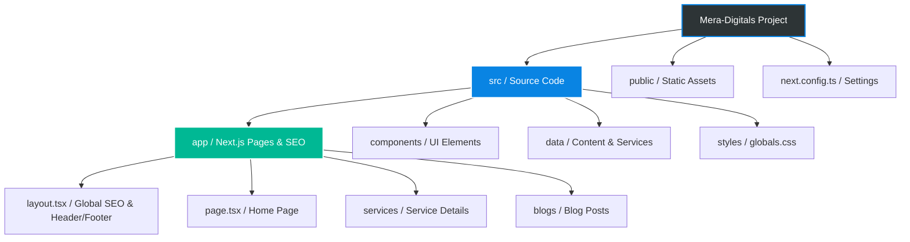
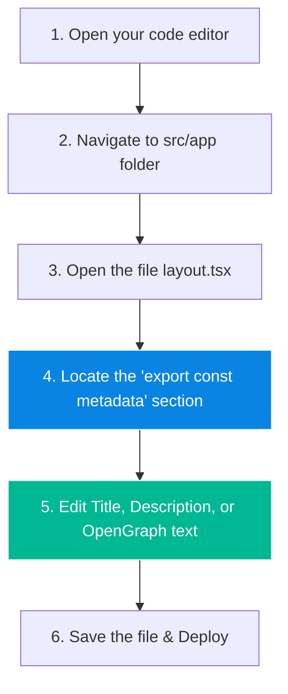
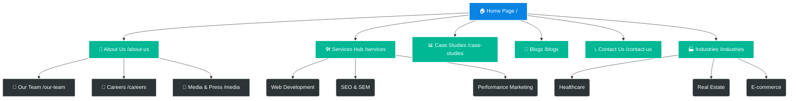

# 🚀 MeraDigital Marketing Agency - Project  Guide

Welcome to the **MeraDigital Marketing Agency** project! This repository contains the source code for the official MeraDigital website. 

This guide is designed to help you understand what this website is, the services it offers, how it's structured, and how you can independently manage **Search Engine Optimization (SEO)** without needing developer assistance.

---

## 🌐 1. What is this Website?

The **MeraDigital Website** is a high-performance, digital storefront built for a marketing agency. It is built using modern web technologies including **Next.js 16 (App Router)**, **React 19**, and **Framer Motion**. It features a stunning "Stark Luxury" glassmorphism aesthetic designed to convert visitors into clients.

### 💼 Services We Offer
The website highlights the following core services offered by the agency:
1. **SEO**: Dominate search results and drive organic growth.
2. **Media Buying**: Maximize Return on Ad Spend (ROAS) with precision targeting.
3. **Web Development**: High-performance, custom Next.js applications.
4. **Performance Marketing**: Results-oriented, data-driven campaigns that scale revenue.
5. **Branding & Design**: Crafting memorable, high-impact brand identities.
6. **Social Media Marketing**: Building an engaged brand presence across all platforms.
7. **Complete Digital Marketing**: A 360° holistic growth strategy for global success.
8. **Online Reputation Management (ORM)**: Protecting your brand and building absolute trust.

---

## 🏗️ 2. Project Structure Overview

Here is a visual representation of how the MeraDigital project is structured:



### Breakdown of Key Folders:
1. **`src/app`**: Contains all the pages (Home, About, Services, Contact). **This is where all global SEO happens.**
2. **`src/data`**: Contains the text content for the website, including all the services text, blogs, and industry details. (Edit files here if you want to change service descriptions).
3. **`src/components`**: Reusable UI blocks like Header, Footer, and Buttons.
4. **`public`**: Where all static images and logos are stored (e.g., `MER_DIGITALS_LOGO.png`).

---

## 🔍 3. How to Manage SEO By Yourself

Search Engine Optimization (SEO) controls how your website looks when people search for it on Google or share a link on social media. 

We have centralized your SEO settings so you only have to edit **one single file** to update your global SEO.

### 📍 Where to do SEO?
**File Location:** `src/app/layout.tsx`

### 🔄 SEO Modification Flowchart



### 🛠️ Step-by-Step Instructions

1. Go to the folder: `src/app/`
2. Open the file named `layout.tsx`.
3. Scroll to the top of the file (around line 13), and look for the `metadata` block that looks like this:

```typescript
export const metadata: Metadata = {
  title: "MeraDigital Marketing Agency", // <--- 1. UPDATE YOUR MAIN TITLE HERE
  description: "Elevate your brand with data-driven strategies and stunning design.", // <--- 2. UPDATE YOUR GOOGLE DESCRIPTION HERE
  icons: {
    icon: '/MER_DIGITALS_LOGO.png',
    apple: '/MER_DIGITALS_LOGO.png',
  },
  openGraph: {
    images: [
      {
        url: '/MER_DIGITALS_LOGO.png', // <--- 3. IMAGE SHOWN ON FACEBOOK/LINKEDIN
        width: 1200,
        height: 630,
        alt: 'Mera Digitals Logo',
      },
    ],
  },
  twitter: {
    card: 'summary_large_image',
    images: ['/MER_DIGITALS_LOGO.png'], // <--- 4. IMAGE SHOWN ON TWITTER
  },
};
```

### 📝 What Each Field Means:
- **`title`**: The name of your site as it appears on Google and in the browser tab.
- **`description`**: The small paragraph of text that shows up below the title on Google searches. Try to keep this under 160 characters.
- **`openGraph.images`**: This controls the image preview when your link is shared on Facebook, LinkedIn, Discord, or iMessage.
- **`twitter.images`**: This controls the image preview when your link is shared on X (formerly Twitter).

### 🚀 How to Apply the Changes
Once you have modified the text inside the quotation marks `" "`:
1. **Save** the file.
2. Commit your changes to your Git repository (or ask your deployment service to rebuild).
3. The changes will automatically be live on your website and visible to Google!

---

## 🗺️ 4. Full Website Architecture & Core Pages

The MeraDigital website is meticulously organized into distinct logical zones to maximize client acquisition, showcase expertise, and drive conversions. Below is the complete architecture map of the website, showing how different pages and user journeys connect.

### 🧭 Core Pages Overview

- **`/` (Home Page):** The main gateway. It focuses on the core value proposition, highlights key services, and features immediate calls-to-action (CTAs).
- **`/about-us`:** Details the agency's history, mission, vision, and core values that drive the team.
- **`/services`:** The central hub listing all marketing, branding, and web development services offered.
- **`/blogs`:** The content marketing engine. Features articles and insights designed to drive top-of-funnel inbound SEO traffic.
- **`/case-studies`:** Showcases past work, client success stories, and concrete ROI metrics (Proof of Work).
- **`/industries`:** Dedicated pages explaining how our services are tailored to specific B2B and B2C sectors.
- **`/our-team`:** Highlights the leadership and expert team members behind the agency.
- **`/careers`:** Open positions and details about the company culture to attract top talent.
- **`/media`:** Press releases, news, and external media coverage.
- **`/contact-us`:** The primary lead generation form and agency contact details.

### 🕸️ Website Architecture Map



---

## 🛠️ Local Development & Installation

If you need to run the project locally on your machine:

1.  **Clone the repository**:
    ```bash
    git clone <repository-url>
    cd Mera-Digitals
    ```

2.  **Install dependencies**:
    ```bash
    npm install
    ```

3.  **Run the development server**:
    ```bash
    npm run dev
    ```

4.  **Open the app**:
    Navigate to `http://localhost:3000` in your browser.
